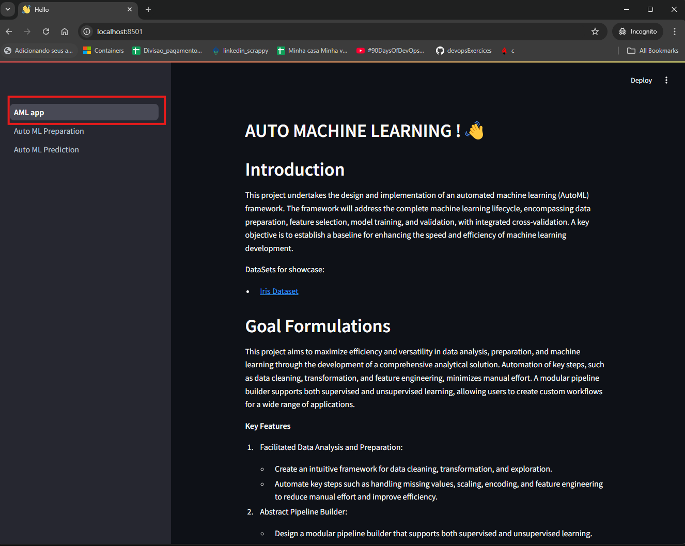
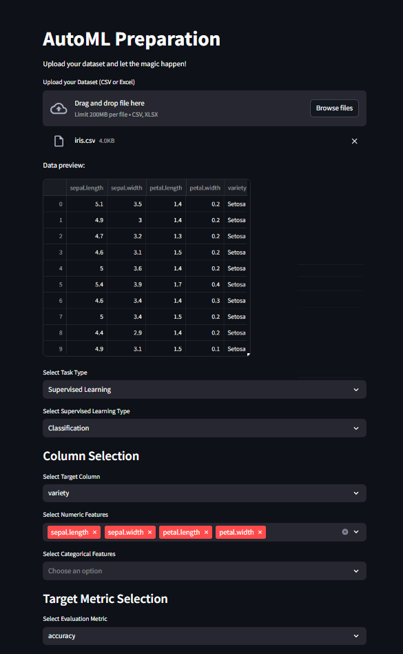
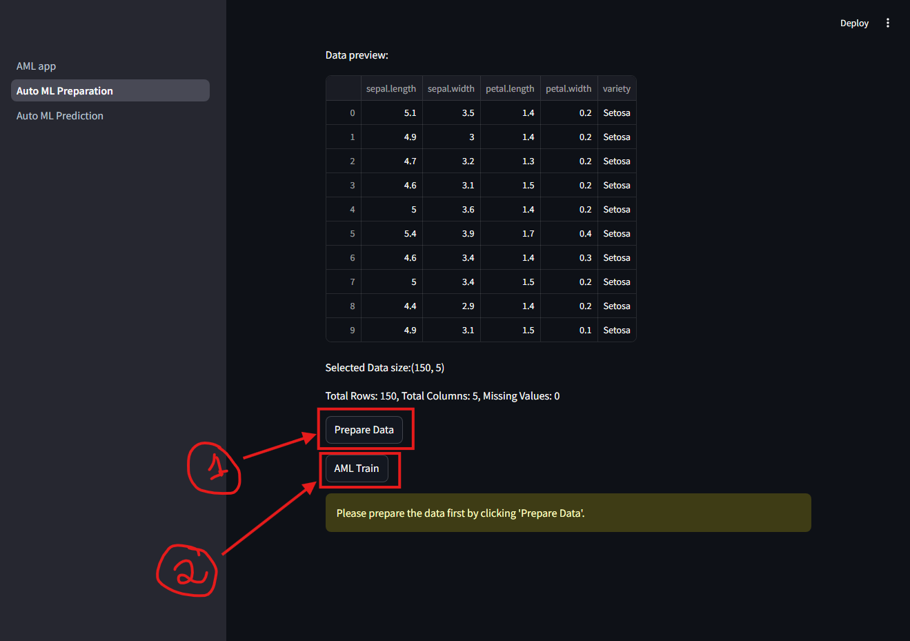
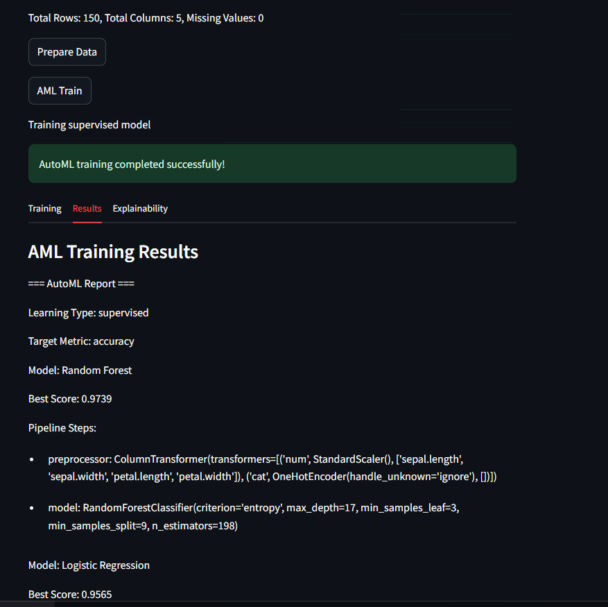
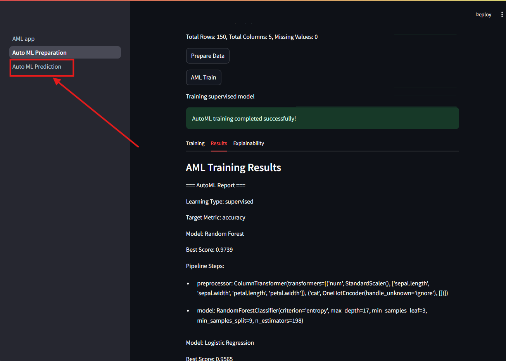
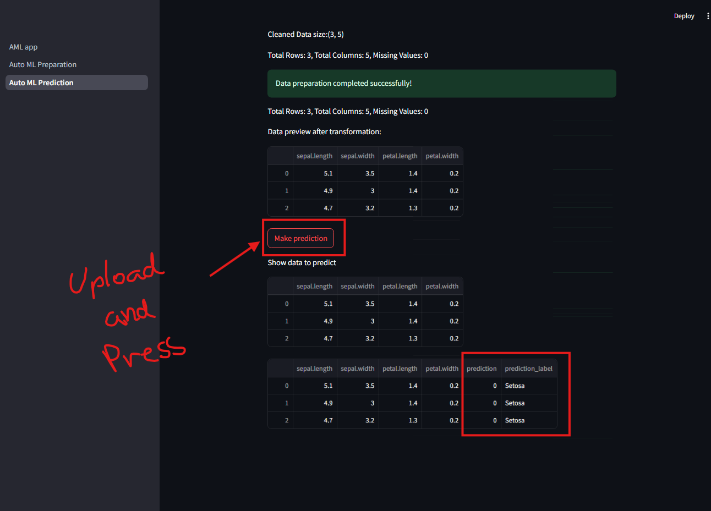

# AML Project

Welcome to the AML Project! This repository contains code for various machine learning algorithms and applications. The main application file is `AML_app.py`.

## Introduction

This project undertakes the design and implementation of an automated machine learning (AutoML) framework. The framework addresses the complete machine learning lifecycle, encompassing data preparation, feature selection, model training, and validation, with integrated cross-validation. A key objective is to establish a baseline for enhancing the speed and efficiency of machine learning development.

## Folder Structure

The project directory is organized as follows:

```
    AML/
    ├── AML_app.py
    ├── pages/
    │   ├── 1_Auto_ML_Preparation.py
    │   ├── 2_Auto_ML_Prediction.py
    ├── saved_models/
    ├── utils.py
    ├── aml.py
    ├── apriori.py
    ├── data_preparation.py
    ├── report_generator.py
    ├── supervised.py
    └── unsupervised.py
 ```

- **utils.py**: Contains utility functions and helper methods used throughout the project for common tasks.

- **aml.py**: Implements the core functionality of the Auto Machine Learning (AML) framework, including the main classes and methods for building and managing machine learning pipelines.

- **apriori.py**: Provides the implementation of the Apriori algorithm for association rule learning, enabling the discovery of interesting relationships and patterns within datasets.

- **data_preparation.py**: Handles data preprocessing tasks such as cleaning, feature scaling, encoding, and imputation, ensuring that the data is ready for machine learning models.

- **data_preprocessing.py**: Handles data_preparation.py methods call.

- **report_generator.py**: Generates comprehensive reports summarizing the results of data analysis and machine learning experiments, including visualizations and performance metrics.

- **supervised.py**: Contains classes and methods specific to supervised learning tasks, such as classification and regression, including model training, evaluation, and hyperparameter tuning.

- **unsupervised.py**: Implements unsupervised learning techniques, such as clustering and dimensionality reduction, providing tools for discovering hidden structures and patterns in the data.

- **AML_app.py, 1_Auto_ML_Preparation.py and  2_Auto_ML_Prediction.py are responsable to create the iterative front-end.**


## Goal Formulations

This project aims to maximize efficiency and versatility in data analysis, preparation, and machine learning through the development of a comprehensive analytical solution. Automation of key steps, such as data cleaning, transformation, and feature engineering, minimizes manual effort. A modular pipeline builder supports both supervised and unsupervised learning, allowing users to create custom workflows for a wide range of applications.

**Key Features**
1. Facilitated Data Analysis and Preparation:
    - Create an intuitive framework for data cleaning, transformation, and exploration.
    - Automate key steps such as handling missing values, scaling, encoding, and feature engineering to reduce manual effort and improve efficiency.

2. Abstract Pipeline Builder:
    - Design a modular pipeline builder that supports both supervised and unsupervised learning.
    - Enable users to define and customize pipelines for tasks like regression.

3. Adaptability Across Problems:
    - Build a solution that is flexible enough to handle a wide range of datasets and problems.
    - Incorporate tools and methods that allow seamless integration of domain-specific requirements.

4. Scalability and Reusability:
    - Ensure the solution can be reused and scaled for different projects and datasets.
    - Provide clear documentation and templates for quick setup and deployment.

## How to Use

1. **Clone the repository:**
    ```bash
    git clone https://github.com/Gutelvam/MasterAI.git
    cd AML
    ```

2. **Install the required dependencies:**
    ```bash
    pip install -r requirements.txt
    ```

3. **Run the main application:**
    ```bash
    streamlit run AML_app.py
    ```
4. **Home page with docummentation**
    - Here you can find a good explanation about the project.
        

5. **Data preparation and training**
    - In this case you can chose among some options and settings before hiting the button to trigger the model training.
        
        
        
        

5. **Make Predictions**
    - In this case you can upload a data that you want to predict without the target variable.
        
        

## Features

- **Data Preprocessing:** Scripts for cleaning and preparing data.
- **Model Training:** Code for training various machine learning models.
- **Evaluation:** Functions for evaluating model performance.
- **Visualization:** Tools for visualizing data and model results.


## License


This project is licensed under the MIT License.

```
MIT License

Permission is hereby granted, free of charge, to any person obtaining a copy
of this software and associated documentation files (the "Software"), to deal
in the Software without restriction, including without limitation the rights
to use, copy, modify, merge, publish, distribute, sublicense, and/or sell
copies of the Software, and to permit persons to whom the Software is
furnished to do so, subject to the following conditions:

The above copyright notice and this permission notice shall be included in all
copies or substantial portions of the Software.

THE SOFTWARE IS PROVIDED "AS IS", WITHOUT WARRANTY OF ANY KIND, EXPRESS OR
IMPLIED, INCLUDING BUT NOT LIMITED TO THE WARRANTIES OF MERCHANTABILITY,
FITNESS FOR A PARTICULAR PURPOSE AND NONINFRINGEMENT. IN NO EVENT SHALL THE
AUTHORS OR COPYRIGHT HOLDERS BE LIABLE FOR ANY CLAIM, DAMAGES OR OTHER
LIABILITY, WHETHER IN AN ACTION OF CONTRACT, TORT OR OTHERWISE, ARISING FROM,
OUT OF OR IN CONNECTION WITH THE SOFTWARE OR THE USE OR OTHER DEALINGS IN THE
SOFTWARE.
```

## Contact

For any questions or suggestions, please open an issue or contact us at [gutto.rdj@gmail.com].

Happy coding!
